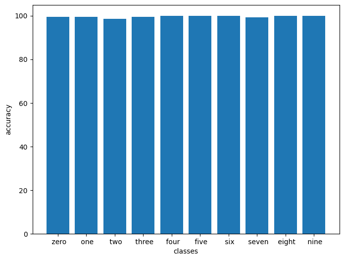

# Submission for Session7

- [Problem Statement](#Problem-Statement)
- [File Structure](#File-Structure)
- [Folder Structure](#Folder-Structure)
- [Model Parameters](#Model-Parameters)
- [Receptive Field and Output Shape Calculation of Best Model](#Receptive-Field-and-Output-Shape-Calculation-of-Best-Model)
- [Results](#Results)
  * [Accuracy Plot](#Accuracy-Plot)
  * [Sample Output](#Sample-Output)
  * [Misclassified Images](#Misclassified-Images)
  * [Accuracy Report for Each class](#Accuracy-Report-for-Each-class)

# Problem Statement

Train CNN on MNIST dataset as :

- 99.4% (this must be consistently shown in your last few epochs, and not a one-time achievement)
- Less than or equal to 15 Epochs
- Less than 8000 Parameters

# Folder Structure

- Module 1 (Basics Done)

  * Contains The basic architecture which has less than 8000 parameters just to satisfy the problem statement basic needs
  * We future introduce dropout as well
- Module 2 (Architecture Improvments)

  * We go ahead any try to fix our architecture so we can start getting closer to the accuracy goal
  * This includes both chaging the layer structure as well as playing with learning rate schedulers
- Module 3 (Final Results)

  * Contains Code with accived target code
  * Also future parameters are reduced and accuracy is mantained

# File Structure

* model.py
  * Contains Model Architecture
* utils.py
  * Contains all the functions which are required to initiate the training
    * Contains data augmentation
    * Test and Train functions
    * Plotting Misclassified results and random prediction code
    * Contains code for plotting the accuracy and loss plot on test and train set
* **.ipynb
  * contains execution of imports from these files
  * One file which compiles down all the code required for training
* logs/
  * collects logs from each and every file
  * mainly used for collecting loss and accuracy during training
* .gitignore
  * For not pushing the unnecessary things available in code folder

Model Comparision
-----------------

|  Module  |                                                                                                                                                             Experiments                                                                                                                                                             | Parameters | Best Test Accuracy |                                                                                                                                              Discription                                                                                                                                              |
| :------: | :---------------------------------------------------------------------------------------------------------------------------------------------------------------------------------------------------------------------------------------------------------------------------------------------------------------------------------: | :--------: | :----------------: | :---------------------------------------------------------------------------------------------------------------------------------------------------------------------------------------------------------------------------------------------------------------------------------------------------: |
| MODULE 1 |                                                                                      [Basic Architecture](https://github.com/deepanshudashora/ERAV1/blob/master/session7/Module%201%20(Basics%20Done)/Basic_skelaton/S7_Base_architecture.ipynb)                                                                                      |   7,964   |       99.25%       |                                     . The Base target is to make a architecture which has less than 8000 parameters, In this stage we do not consider any points for accuracy, Batch Normalization is alredy done since we know we need to introduce it furture.                                     |
|          |                                                                                               [Dropout Introduced](https://github.com/deepanshudashora/ERAV1/blob/master/session7/Module%201%20(Basics%20Done)/Dropout/S7_Dropout.ipynb)                                                                                               |   7,964   |       99.29%       |                                                                            Since the model is overfitting, it's time to introduce dropout, after few experiments, the correct dropout value was found and model was stable                                                                            |
| MODULE 2 |                                                                 [Transition Block Location](https://github.com/deepanshudashora/ERAV1/blob/master/session7/Module%202%20(Architecture%20Improvments)/maxpool_postion_changed/S7_Maxpool_and_transition_changed.ipynb)                                                                 |   7,824   |       99.35%       |                                      Changing the pooling layer location and transition block location helps a lot in learning of network, compare with Module1 architecture, this time the maxpooling is used after 5x5 receptive field which changed the game                                      |
|          | LR Schedulers[[StepLR](https://github.com/deepanshudashora/ERAV1/blob/master/session7/Module%202%20(Architecture%20Improvments)/LR_Scheduler_exp/S7_STEPLR.ipynb) & [OneCyclePolicy](https://github.com/deepanshudashora/ERAV1/blob/master/session7/Module%202%20(Architecture%20Improvments)/LR_Scheduler_exp/S7_OneCyclePolicy.ipynb)] |   7,824   |       99.43%       | Majorly two LR schedulers are experimented here, OneCycleLR and StepLR, stepLr seems to work better in terms of giving accuracy, The Future explanation of this experiments is available in the Module specific readme file, This is where we meet our goal of getting the 99,4% consistantly as well |
| MODULE 3 |                                                                             [Data Augmentation](https://github.com/deepanshudashora/ERAV1/blob/master/session7/Module%203%20(Final%20Results)/Most_accurate/S7_Augmentation_and_transition_changes.ipynb)                                                                             |   7,824   |       99.50%       |                                                                                        The Limits are pushed furture and data augmentation is added, This lead to the best testing accuracy of this experiment                                                                                        |
|          |                                                                                 [Final Submission](https://github.com/deepanshudashora/ERAV1/blob/master/session7/Module%203%20(Final%20Results)/Best_with_reduced_param/S7_Reduced_param_99.4.ipynb)                                                                                 |   6,084   |       99.45%       |                                                                                      Since model parameters are so close to 8000, time to reduce them even more, and it was successful, finally 99.45 is achived                                                                                      |

# Model Parameters

---------------------------------------------------------------

         Layer (type)               Output Shape         Param #
---------------------------------------------------------------

            Conv2d-1            [-1, 4, 26, 26]              36
              ReLU-2            [-1, 4, 26, 26]               0
       BatchNorm2d-3            [-1, 4, 26, 26]               8
           Dropout-4            [-1, 4, 26, 26]               0
            Conv2d-5           [-1, 10, 24, 24]             360
              ReLU-6           [-1, 10, 24, 24]               0
       BatchNorm2d-7           [-1, 10, 24, 24]              20
           Dropout-8           [-1, 10, 24, 24]               0
         MaxPool2d-9           [-1, 10, 12, 12]               0
           Conv2d-10            [-1, 8, 12, 12]              80
             ReLU-11            [-1, 8, 12, 12]               0
      BatchNorm2d-12            [-1, 8, 12, 12]              16
          Dropout-13            [-1, 8, 12, 12]               0
           Conv2d-14            [-1, 4, 12, 12]              32
             ReLU-15            [-1, 4, 12, 12]               0
      BatchNorm2d-16            [-1, 4, 12, 12]               8
          Dropout-17            [-1, 4, 12, 12]               0
           Conv2d-18           [-1, 10, 10, 10]             360
             ReLU-19           [-1, 10, 10, 10]               0
      BatchNorm2d-20           [-1, 10, 10, 10]              20
          Dropout-21           [-1, 10, 10, 10]               0
           Conv2d-22             [-1, 16, 8, 8]           1,440
             ReLU-23             [-1, 16, 8, 8]               0
      BatchNorm2d-24             [-1, 16, 8, 8]              32
          Dropout-25             [-1, 16, 8, 8]               0
           Conv2d-26             [-1, 12, 6, 6]           1,728
             ReLU-27             [-1, 12, 6, 6]               0
      BatchNorm2d-28             [-1, 12, 6, 6]              24
          Dropout-29             [-1, 12, 6, 6]               0
           Conv2d-30             [-1, 16, 4, 4]           1,728
             ReLU-31             [-1, 16, 4, 4]               0
      BatchNorm2d-32             [-1, 16, 4, 4]              32
          Dropout-33             [-1, 16, 4, 4]               0
        AvgPool2d-34             [-1, 16, 1, 1]               0
           Conv2d-35             [-1, 10, 1, 1]             160
---------------------------------------------------------------

* Total params: 6,084
* Trainable params: 6,084
* Non-trainable params: 0

---------------------------------------------------------------

* Input size (MB): 0.00
* Forward/backward pass size (MB): 0.40
* Params size (MB): 0.02
* Estimated Total Size (MB): 0.43

---------------------------------------------------------------

# Receptive Field and Output Shape Calculation of Best Model

| Block                  | Layer   | receptive-field_in | n_in | j_in | stride | padding | kernel_size | recptive-field out | n_out | j_out |
| ---------------------- | ------- | ------------------ | ---- | ---- | ------ | ------- | ----------- | ------------------ | ----- | ----- |
| Convolution Block      | conv1   | 1                  | 28   | 1    | 1      | 0       | 3           | 3                  | 26    | 1     |
|                        | conv2   | 3                  | 26   | 1    | 1      | 0       | 3           | 5                  | 24    | 1     |
| Pooling Layer          | maxpool | 5                  | 24   | 1    | 2      | 0       | 2           | 6                  | 12    | 2     |
| Transition Block       | conv3   | 6                  | 12   | 2    | 1      | 0       | 1           | 6                  | 12    | 2     |
|                        | conv4   | 6                  | 12   | 2    | 1      | 0       | 1           | 6                  | 12    | 2     |
| Convolution Block      | conv5   | 6                  | 12   | 2    | 1      | 0       | 3           | 10                 | 10    | 2     |
|                        | conv6   | 10                 | 10   | 2    | 1      | 0       | 3           | 14                 | 8     | 2     |
| Convolution Block      | conv7   | 14                 | 8    | 2    | 1      | 0       | 3           | 18                 | 6     | 2     |
|                        | conv8   | 18                 | 6    | 2    | 1      | 0       | 3           | 22                 | 4     | 2     |
| Global Average Pooling | GAP     | 22                 | 4    | 2    | 1      | 0       | 4           | 28                 | 1     | 2     |
| 1x1                    | conv9   | 28                 | 1    | 2    | 1      | 0       | 1           | 28                 | 1     | 2     |

# Training Logs

    Adjusting learning rate of group 0 to 1.0000e-02.
    Epoch 1
    Train: Loss=0.1209 Batch_id=937 Accuracy=92.49: 100%|██████████| 938/938 [00:51<00:00, 18.29it/s]
    Test set: Average loss: 0.0539, Accuracy: 9832/10000 (98.32%)

    Adjusting learning rate of group 0 to 1.0000e-02.
    Epoch 2
    Train: Loss=0.0055 Batch_id=937 Accuracy=98.02: 100%|██████████| 938/938 [00:54<00:00, 17.25it/s]
    Test set: Average loss: 0.0412, Accuracy: 9881/10000 (98.81%)

    Adjusting learning rate of group 0 to 1.0000e-02.
    Epoch 3
    Train: Loss=0.0153 Batch_id=937 Accuracy=98.39: 100%|██████████| 938/938 [00:53<00:00, 17.68it/s]
    Test set: Average loss: 0.0349, Accuracy: 9894/10000 (98.94%)

    Adjusting learning rate of group 0 to 1.0000e-02.
    Epoch 4
    Train: Loss=0.0680 Batch_id=937 Accuracy=98.73: 100%|██████████| 938/938 [00:56<00:00, 16.62it/s]
    Test set: Average loss: 0.0292, Accuracy: 9912/10000 (99.12%)

    Adjusting learning rate of group 0 to 1.0000e-02.
    Epoch 5
    Train: Loss=0.0078 Batch_id=937 Accuracy=98.72: 100%|██████████| 938/938 [00:53<00:00, 17.45it/s]
    Test set: Average loss: 0.0234, Accuracy: 9928/10000 (99.28%)

    Adjusting learning rate of group 0 to 1.0000e-02.
    Epoch 6
    Train: Loss=0.0152 Batch_id=937 Accuracy=98.84: 100%|██████████| 938/938 [00:53<00:00, 17.46it/s]
    Test set: Average loss: 0.0274, Accuracy: 9913/10000 (99.13%)

    Adjusting learning rate of group 0 to 3.0000e-03.
    Epoch 7
    Train: Loss=0.0047 Batch_id=937 Accuracy=99.16: 100%|██████████| 938/938 [00:53<00:00, 17.51it/s]
    Test set: Average loss: 0.0226, Accuracy: 9935/10000 (99.35%)

    Adjusting learning rate of group 0 to 3.0000e-03.
    Epoch 8
    Train: Loss=0.0099 Batch_id=937 Accuracy=99.22: 100%|██████████| 938/938 [00:52<00:00, 17.85it/s]
    Test set: Average loss: 0.0219, Accuracy: 9932/10000 (99.32%)

    Adjusting learning rate of group 0 to 3.0000e-03.
    Epoch 9
    Train: Loss=0.0011 Batch_id=937 Accuracy=99.27: 100%|██████████| 938/938 [00:54<00:00, 17.32it/s]
    Test set: Average loss: 0.0212, Accuracy: 9932/10000 (99.32%)

    Adjusting learning rate of group 0 to 3.0000e-03.
    Epoch 10
    Train: Loss=0.2137 Batch_id=937 Accuracy=99.27: 100%|██████████| 938/938 [00:56<00:00, 16.73it/s]
    Test set: Average loss: 0.0202, Accuracy: 9938/10000 (99.38%)

    Adjusting learning rate of group 0 to 3.0000e-03.
    Epoch 11
    Train: Loss=0.0166 Batch_id=937 Accuracy=99.30: 100%|██████████| 938/938 [00:53<00:00, 17.38it/s]
    Test set: Average loss: 0.0205, Accuracy: 9938/10000 (99.38%)

    Adjusting learning rate of group 0 to 3.0000e-03.
    Epoch 12
    Train: Loss=0.0061 Batch_id=937 Accuracy=99.30: 100%|██████████| 938/938 [00:54<00:00, 17.28it/s]
    Test set: Average loss: 0.0201, Accuracy: 9941/10000 (99.41%)

    Adjusting learning rate of group 0 to 9.0000e-04.
    Epoch 13
    Train: Loss=0.0158 Batch_id=937 Accuracy=99.42: 100%|██████████| 938/938 [00:52<00:00, 17.80it/s]
    Test set: Average loss: 0.0193, Accuracy: 9945/10000 (99.45%)

    Adjusting learning rate of group 0 to 9.0000e-04.
    Epoch 14
    Train: Loss=0.1063 Batch_id=937 Accuracy=99.40: 100%|██████████| 938/938 [00:52<00:00, 17.85it/s]
    Test set: Average loss: 0.0194, Accuracy: 9945/10000 (99.45%)

    Adjusting learning rate of group 0 to 9.0000e-04.
    Epoch 15
    Train: Loss=0.0379 Batch_id=937 Accuracy=99.46: 100%|██████████| 938/938 [00:52<00:00, 17.84it/s]
    Test set: Average loss: 0.0203, Accuracy: 9939/10000 (99.39%)

    Adjusting learning rate of group 0 to 9.0000e-04.

# Results

## Accuracy Plot

Here is the Accuracy and Loss metric plot for the model

    

## Sample Output

Here is the sample result of model classification

    

## Misclassified Images

Here is the sample result of model miss-classified images

    

## Accuracy Report for Each class

    Accuracy of 0 - zero : 99 %
    Accuracy of 1 - one : 99 %
    Accuracy of 2 - two : 98 %
    Accuracy of 3 - three : 99 %
    Accuracy of 4 - four : 100 %
    Accuracy of 5 - five : 100 %
    Accuracy of 6 - six : 100 %
    Accuracy of 7 - seven : 99 %
    Accuracy of 8 - eight : 100 %
    Accuracy of 9 - nine : 100 %

    

